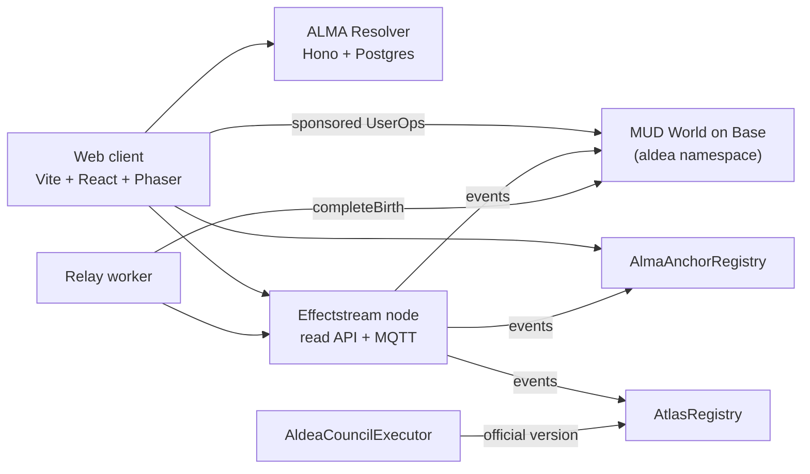

# ALDEA World

**Born with a soul. Fork the world.**

**The multichain autonomous world where every character is born with a soul — and the open template for any
community or brand to launch its own.**

Players sign in with **Sign in with ALMA** — a passkey, an email code or a wallet they already have; no passwords,
no wallet to install and no gas — pick one of 11 classes at the Town Center and are born into one of
5 tribes through a fair on-chain draw. At that moment their human **ALMA** (a portable identity) is anchored on Base
and joins their tribe's ALMA organization. The **Atlas** registry lists every world, version, fork and client, and
[aldea.world](https://aldea.world) serves exactly the version the community ratified as official.

ALDEA World is owned and governed by [ALDEA DAO](https://aldea-dao.org). It is built by
[AdaSouls](https://github.com/AdaSouls) on top of reusable, open rails (ALMA, the Atlas and the fork kit) that any
brand can use for its own world.

> **Status:** pre-alpha. Phase 0 (foundation) is complete: contracts, local stack, services skeletons and CI.
> Next: Sign in with ALMA and the first birth on Base Sepolia (Phase 1).

## How it fits together



- **On-chain (Base):** the MUD World holds the game state; `AlmaAnchorRegistry` anchors souls and organizations;
  `AtlasRegistry` records worlds, versions and clients; `AldeaCouncilExecutor` applies the community's Genesis Charter.
  The two registries are rails shared by every world and live in
  [`AdaSouls/protocol`](https://github.com/AdaSouls/protocol) (`@adasouls/protocol` on npm).
- **Effectstream** folds Base (and later Cardano) events into a deterministic read model, serves the read API and
  pushes real-time events over MQTT.
- **ALMA Auth** (inside the ALMA Resolver) is the OpenID Connect provider behind *Sign in with ALMA*: the soul is the
  user, and passkeys, email, social accounts and wallets on every chain are keys linked to it. Turnkey holds the keys of
  players without a wallet; a Coinbase Smart Wallet on Base owns each character.
- **ALMA Resolver** stores ALMA documents and links, and signs Founder attestations.
- **Relay worker** executes the read model's write intents (for example, completing births).

Each package documents its own design in code comments; the Effectstream integration notes are in
[`packages/effectstream-node/SPIKE.md`](packages/effectstream-node/SPIKE.md).

## Repository layout

| Path | What it is |
|---|---|
| `packages/contracts` | MUD World (`aldea` namespace): Character, Movement, Founder and Admin systems |
| `packages/council` | `AldeaCouncilExecutor` and ALDEA's deploy script (Foundry): the rails from `@adasouls/protocol`, the world's ALMA organizations and the Council |
| `packages/shared` | Shared TypeScript: catalogs, ALMA helpers, EIP-712 types, ABIs, deployments |
| `packages/client` | Web client (Vite, React, Tailwind, Phaser) |
| `packages/alma-resolver` | ALMA Resolver (Hono, Drizzle, Postgres) |
| `packages/effectstream-node` | Effectstream node (Bun): read model, STFs, API, MQTT |
| `packages/relay-worker` | Relay worker ("the Midwife") |
| `packages/cli` | `aldea` fork kit CLI — moving to `AdaSouls/fork-kit` |
| `infra/`, `scripts/` | Local orchestration and deployment scripts |
| `reference/` | The verified reference contracts the packages were migrated from |

## Getting started

**Requirements:** Node 24 (`.nvmrc`), pnpm 9 (`corepack enable`), [Foundry](https://getfoundry.sh),
[Bun](https://bun.sh) and [Podman](https://podman.io) (or Docker).

```bash
pnpm install
pnpm dev            # Postgres + anvil in containers, then every service (mprocs)
pnpm dev:lite       # same stack without containers (anvil + embedded PGlite, in memory)
pnpm dev:health     # checks anvil, Resolver, Effectstream, relay, MUD indexer and client
```

`pnpm dev` deploys the protocol contracts and the World to a fresh local anvil (`scripts/dev-deploy.sh`) and writes the
addresses to `packages/shared/src/deployments/31337.json`. The client runs on <http://localhost:3000> (design kit at
`#/ui`).

| Service | Port |
|---|---|
| anvil | 8545 |
| Postgres (containers) | 5442 |
| Client | 3000 |
| MUD indexer API | 3001 |
| ALMA Resolver | 8787 |
| Relay worker | 8788 |
| Effectstream API / MQTT (TCP, WS) | 9999 / 8883, 9883 |

### Tests

```bash
pnpm lint && pnpm -r typecheck
pnpm --filter contracts test          # mud test: World tests, invariants, fuzzing, tribe-draw uniformity
(cd packages/council && forge test)   # Council executor and deploy script
pnpm --filter @aldea/shared test      # also: @aldea/alma-resolver, @aldea/effectstream-node
```

CI runs the same checks plus Slither and gitleaks on every pull request.

## Forking ALDEA World

ALDEA World is designed to be forked: register your organization and world in the Atlas, deploy your own World and
publish your client. A step-by-step fork guide arrives with the fork kit CLI. Code is MIT; the ALDEA name, lore
and art are not part of the code license — **you fork the world, not the brand** (see [Licensing](#licensing)).

## Governance and trust

The ALDEA DAO Safe (a multisig of ALDEA stake pool operators) owns the World's namespace, the protocol admin roles on
ALDEA's deployment and the official version in the Atlas. Until those powers are fully decentralized, some roles are
operated by AdaSouls as **declared temporary trust** (the Founder attestation signer, the relayer, repository
administration). They are listed in [GOVERNANCE.md](GOVERNANCE.md).

## Contributing

Contributions are welcome — read [CONTRIBUTING.md](CONTRIBUTING.md) and the [Code of Conduct](CODE_OF_CONDUCT.md).
Report vulnerabilities privately as described in [SECURITY.md](SECURITY.md).

## Licensing

- **Code:** [MIT](LICENSE).
- **ALDEA brand assets, lore and art:** [CC BY-NC-SA 4.0](LICENSE-ASSETS.md), for non-commercial community forks. The
  ALDEA name and logos are not licensed for use as your own brand.
